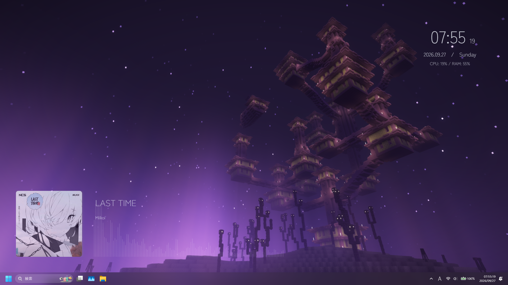
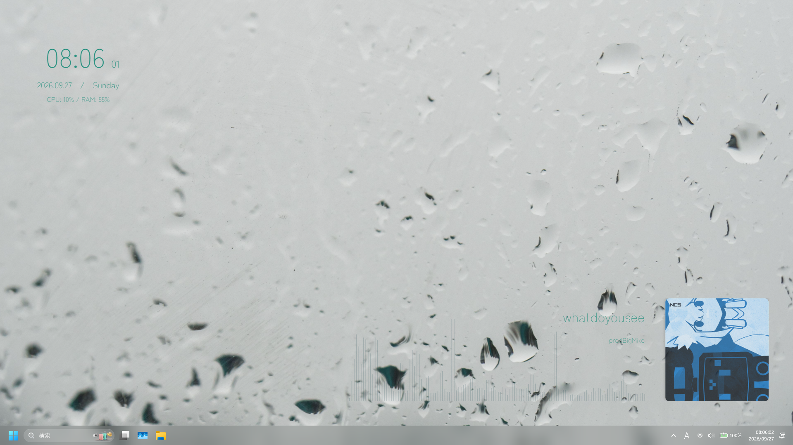

# Minimal Media Overlay

時計、CPU/RAM使用率、再生中の曲情報とオーディオビジュアライザーを表示するLively Wallpaper向け壁紙です。  
背景には画像または動画を設定できます。

## サンプル

| 1 | 2 |
|:---:|:---:|
|  |  |
| 楽曲: [Milkoi - LAST TIME](https://ncs.io/lasttime) Music provided by NoCopyrightSounds | 楽曲: [prodBigMike!, GlitchCat - whatdoyousee](https://ncs.io/whatdoyousee) Music provided by NoCopyrightSounds |

## インストール

1. [Lively Wallpaper](https://www.rocksdanister.com/lively/)をインストールします。
2. Lively Wallpaperで壁紙の追加を選び、このリポジトリのzipファイルをドラッグ&ドロップします。

## 設定

Lively Wallpaperの壁紙設定(カスタマイズ)から、CPU/RAM表示、背景メディア、文字色、波形の色と感度、動画音量、背景ぼかし、時計と音楽情報の位置を変更できます。

日本語・中国語の設定ラベルを含みます。フォントはGoogle Fontsから読み込むため、ネットワークに接続できない場合はシステムのsans-serifフォントにフォールバックします。

## ライセンス

このリポジトリのソースコードは、[LICENSE](LICENSE)に記載されたMIT Licenseの下で公開しています。このライセンスは、以下に記載する第三者の楽曲・商標・コンテンツには適用されません。

## 第三者コンテンツに関する表記

サンプル画像1には[LAST TIME](https://ncs.io/lasttime)（Milkoi）、サンプル画像2には[whatdoyousee](https://ncs.io/whatdoyousee)（prodBigMike!, GlitchCat）の楽曲情報・アートワークが含まれています。音源ファイルは同梱していません。

Minecraftは本リポジトリとは無関係であり、公式製品ではありません。

NOT AN OFFICIAL MINECRAFT PRODUCT. NOT APPROVED BY OR ASSOCIATED WITH MOJANG OR MICROSOFT.